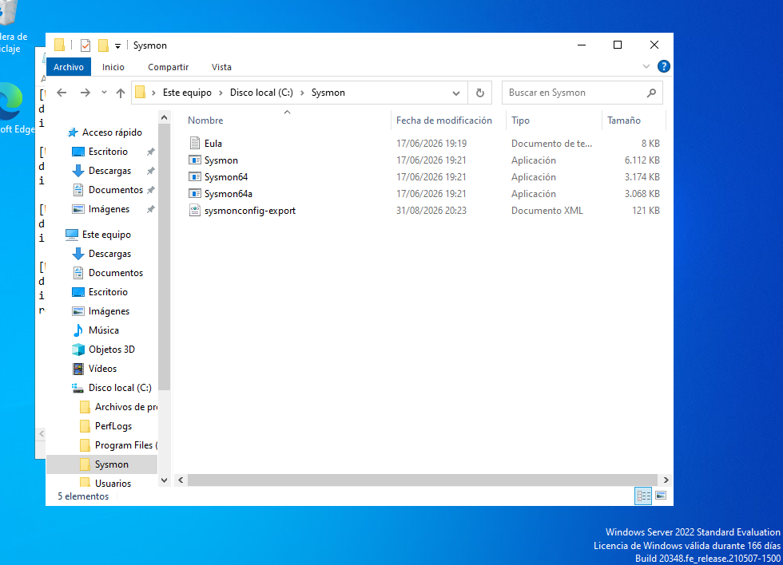
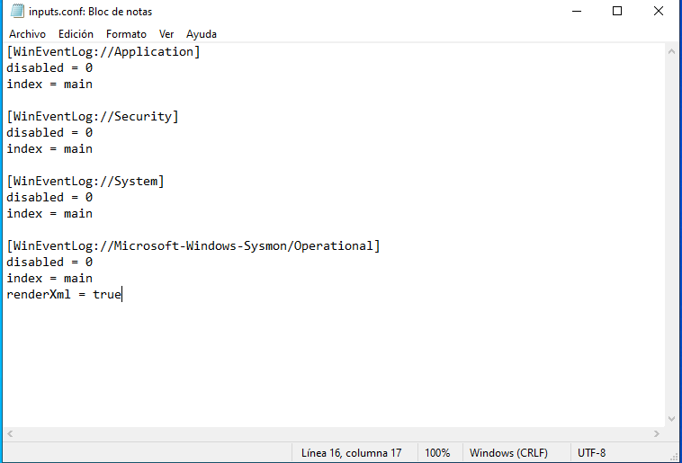
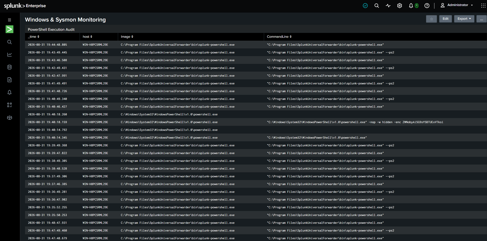
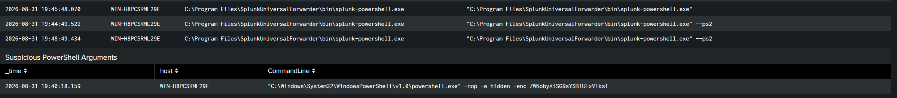
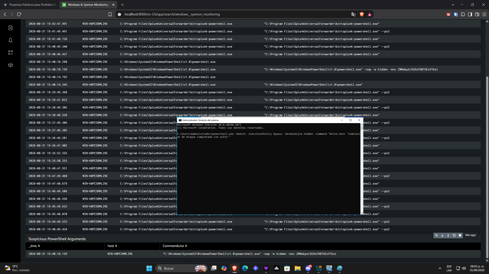
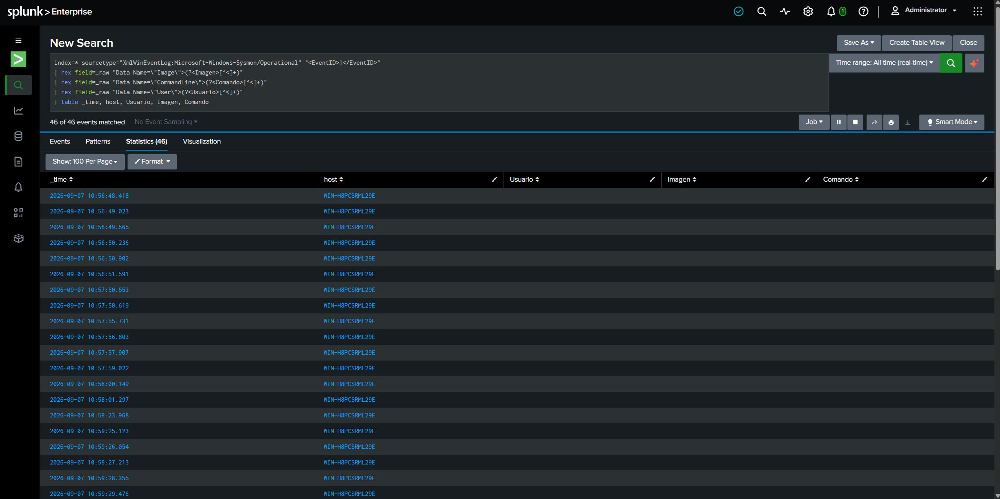
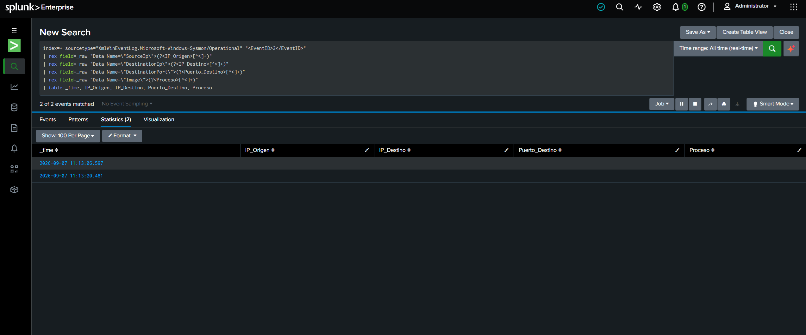

# Lab 3: Detección de Amenazas y Canalización de Telemetría (Splunk + Sysmon + Red vs Blue)

## Resumen Ejecutivo
Este proyecto detalla el despliegue e implementación completa de un laboratorio de monitoreo de seguridad empresarial bajo una arquitectura **Red vs Blue**. El objetivo principal fue recolectar telemetría profunda a nivel de sistema operativo en **Windows Server 2022** utilizando **Microsoft Sysmon**, reenviar los eventos en formato XML mediante **Splunk Universal Forwarder**, construir paneles de detección en **Splunk Enterprise** y validar la captura de amenazas ante vectores de red y ejecución generados desde **Kali Linux**.

---

## Arquitectura de la Infraestructura

| Nodo | Sistema Operativo | Función y Herramientas Aplicadas |
| :--- | :--- | :--- |
| **SIEM / Indexer** | Windows 11 (Host) | Splunk Enterprise (Escucha en puerto TCP `9997`) |
| **Víctima / Target** | Windows Server 2022 | Sysmon v14+, Splunk Universal Forwarder |
| **Atacante / Red Team** | Kali Linux | Nmap (`-sT`), Escaneo de Red, Generación de Tráfico |

---

## Implementación por Fases y Flujo de Trabajo

### Fase 1: Auditoría del Endpoint y Despliegue de Sysmon
Se configuró un monitoreo avanzado a nivel de kernel en el servidor objetivo para capturar la creación de procesos, argumentos en línea de comandos y sockets de red activos.

* Instalación de Sysmon mediante un archivo de reglas personalizado (`sysmonconfig-export.xml`) ubicado en `C:\Sysmon\`.

---

### Fase 2: Reenvío de Logs y Ajuste de Ingesta XML
Configuración del agente **Splunk Universal Forwarder** en el servidor objetivo para extraer eventos directamente del canal `Microsoft-Windows-Sysmon/Operational`.

* Se editó el archivo `inputs.conf` añadiendo el parámetro `renderXml = true` para preservar la estructura completa de las etiquetas XML durante el transporte y evitar el truncamiento de datos.

[WinEventLog://Microsoft-Windows-Sysmon/Operational]
disabled = 0
index = main
renderXml = true

---

### Fase 3: Construcción de Dashboards y Monitoreo Inicial
Antes de ejecutar los vectores de ataque desde Kali Linux, se diseñaron paneles en Splunk para auditar la ejecución de PowerShell e identificar parámetros sospechosos o codificados en línea de comandos (ej. `-nop -w hidden -enc`).

1. **Auditoría de Ejecución de PowerShell:** Seguimiento de instancias de `powershell.exe` y procesos derivados.

2. **Identificación de Argumentos Sospechosos:** Detección de comandos ofuscados o codificados utilizados para evadir directivas de seguridad.

---

### Fase 4: Simulación de Ataque y Parsing de XML en Tiempo de Búsqueda (SPL)
Para cerrar el ciclo de detección, se ejecutaron escaneos de red TCP desde **Kali Linux** (`nmap -sT`) y peticiones salientes desde el servidor objetivo (`Invoke-WebRequest`).

Dado que los logs ingresaron en XML crudo, se desarrollaron consultas avanzadas en **Search Processing Language (SPL)** utilizando expresiones regulares (`rex`) para extraer los campos al momento de la búsqueda.

#### 1. Análisis de Ejecución de Procesos (`Sysmon EventID 1`)
Extrae la ruta de los ejecutables, comandos ejecutados y el contexto del usuario:

index=* sourcetype="XmlWinEventLog:Microsoft-Windows-Sysmon/Operational" "<EventID>1</EventID>"
| rex field=_raw "Data Name=\"Image\">(?<Imagen>[^<]+)"
| rex field=_raw "Data Name=\"CommandLine\">(?<Comando>[^<]+)"
| rex field=_raw "Data Name=\"User\">(?<Usuario>[^<]+)"
| table _time, host, Usuario, Imagen, Comando

#### 2. Telemetría de Conexiones de Red (`Sysmon EventID 3`)
Rastrea direcciones IP de origen y destino, puertos objetivo y el proceso emisor durante interacciones de red:

index=* sourcetype="XmlWinEventLog:Microsoft-Windows-Sysmon/Operational" "<EventID>3</EventID>"
| rex field=_raw "Data Name=\"SourceIp\">(?<IP_Origen>[^<]+)"
| rex field=_raw "Data Name=\"DestinationIp\">(?<IP_Destino>[^<]+)"
| rex field=_raw "Data Name=\"DestinationPort\">(?<Puerto_Destino>[^<]+)"
| rex field=_raw "Data Name=\"Image\">(?<Proceso>[^<]+)"
| table _time, IP_Origen, IP_Destino, Puerto_Destino, Proceso

---

## Habilidades Técnicas Demostradas

* **Ingeniería de SIEM y Flujo de Logs:** Ingesta de datos, renderizado XML y configuración de Universal Forwarder.
* **Ingeniería de Detección (SPL y Regex):** Extracción de campos en tiempo de búsqueda con `rex`, análisis de nodos XML y optimización de consultas.
* **Telemetría de Endpoints:** Gestión de reglas de Sysmon, registros de eventos de Windows y auditoría de procesos.
* **Metodología Red vs Blue:** Reconocimiento de red (`nmap`), generación de tráfico y verificación de alertas.
